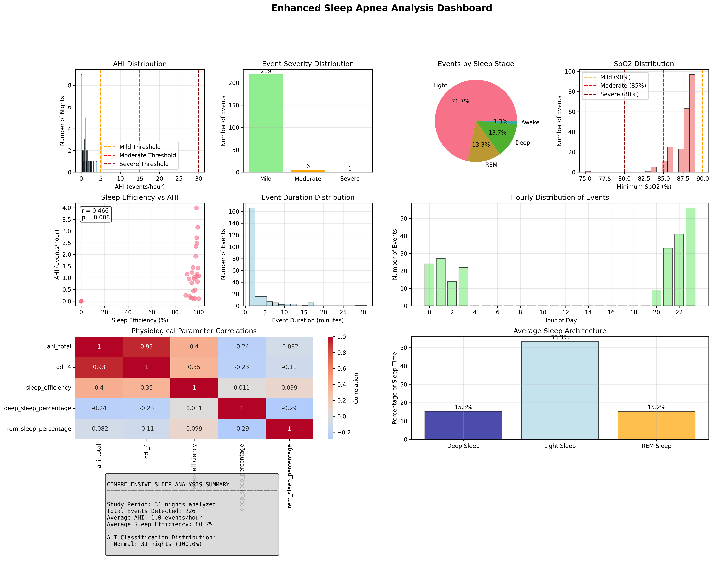

# Sleep Apnea & Low SpO2 Event Analyzer

[](https://www.python.org/downloads/)
[](LICENSE)

This Python project analyzes sleep data from JSON files, specifically focusing on detecting, analyzing, and visualizing low blood oxygen saturation (SpO2) events. It processes daily sleep records, identifies periods of low SpO2, correlates them with other physiological parameters (Heart Rate, Respiration, HRV, Sleep Stages, Movement, Stress), and generates a comprehensive text report and visual plots.

<p align="center">
  
</p>

## Table of Contents

- [Sleep Apnea \& Low SpO2 Event Analyzer](#sleep-apnea--low-spo2-event-analyzer)
  - [Table of Contents](#table-of-contents)
  - [Features](#features)
  - [Project Structure](#project-structure)
  - [Prerequisites](#prerequisites)
  - [Installation](#installation)
  - [Input Data Format](#input-data-format)
  - [Obtaining Input Data](#obtaining-input-data)
  - [Usage](#usage)
  - [Configuration](#configuration)
  - [Script Overview (`main.py`)](#script-overview-mainpy)
  - [Potential Future Enhancements](#potential-future-enhancements)
  - [Troubleshooting](#troubleshooting)
  - [Contribution](#contribution)
  - [License](#license)

## Features

*   **JSON Data Ingestion:** Loads sleep data from multiple JSON files in a specified directory.
*   **Low SpO2 Event Detection:** Identifies consecutive periods where SpO2 drops below a configurable threshold (default: < 90%).
*   **Multi-Parameter Correlation:** For each detected low SpO2 event, it extracts and averages contemporaneous:
    *   Heart Rate (HR)
    *   Respiration Rate
    *   Heart Rate Variability (HRV)
    *   Sleep Stress
    *   Movement Level
    *   Dominant Sleep Stage
*   **Daily Analysis:** Provides a breakdown of low SpO2 events for each day's sleep record.
*   **Overall Dataset Analysis:** Aggregates statistics across all processed files, including:
    *   Total number of events
    *   Average minimum SpO2 during events
    *   Overall lowest SpO2 recorded in an event
    *   Average and longest event durations
*   **Detailed Event Reporting:** Generates a `analysis_report.txt` file summarizing:
    *   Event start and end times
    *   Event duration
    *   Minimum and average SpO2 during the event
    *   Minute-by-minute SpO2 readings and confidence levels within the event
    *   Average correlated physiological parameters during the event
*   **Visualizations:**
    *   **Individual Event Plots:** For significant events, generates time-series plots showing SpO2, Heart Rate, and Respiration Rate, with sleep stages as a background. This helps visualize the physiological context of the desaturation.
    *   **Overall Summary Plots:**
        *   Distribution of minimum SpO2 values during events.
        *   Distribution of low SpO2 event durations.
        *   Distribution of low SpO2 events by the hour of the day (GMT).
*   **Configurable Thresholds:** Easily adjust the SpO2 threshold for event detection.

## Project Structure

```
sleep_apnea_analyzer/
├── data/                     # Folder to place your input JSON sleep data files
│   └── 2025-05-14.json       # Example input file
│   └── ...
├── sleep_analysis_output/    # Generated output folder
│   ├── event_plots/          # Folder for individual event plot images
│   │   └── 2025-05-14_event_1.png
│   │   └── ...
│   └── analysis_report.txt   # Main analysis report file
├── main.py                   # The main Python script for the analysis
└── README.md                 # This README file
```

## Prerequisites

*   Python 3.8 or higher
*   The following Python libraries:
    *   `pandas`
    *   `matplotlib`
    *   `numpy`

## Installation

1.  **Clone the repository (or download the files):**
    ```bash
    git clone <repository_url>
    cd sleep_apnea_analyzer
    ```

2.  **Create a virtual environment (recommended):**
    ```bash
    python -m venv env
    source env/bin/activate  # On Windows: env\Scripts\activate
    ```

3.  **Install required libraries:**
    ```bash
    pip install -r requirements.txt
    ```

## Input Data Format

The script expects JSON files in the `data/` directory. Each JSON file should represent one night's sleep data and contain a main key `dailySleepDTO` with a structure similar to the example provided in the initial problem description. Key fields utilized by the script include:

*   `dailySleepDTO.calendarDate`
*   `dailySleepDTO.wellnessEpochSPO2DataDTOList`: Array of SpO2 readings per minute.
    *   `epochTimestamp` (GMT timestamp string)
    *   `spo2Reading` (integer)
    *   `readingConfidence` (integer)
*   `dailySleepDTO.sleepHeartRate`: Array of heart rate values.
    *   `startGMT` (millisecond epoch timestamp)
    *   `value` (integer)
*   `dailySleepDTO.wellnessEpochRespirationDataDTOList`: Array of respiration values.
    *   `startTimeGMT` (millisecond epoch timestamp)
    *   `respirationValue` (float/integer)
*   `dailySleepDTO.sleepLevels`: Array defining sleep stages over time.
    *   `startGMT`, `endGMT` (GMT timestamp strings)
    *   `activityLevel` (0: Deep, 1: Light, 2: REM, 3: Awake)
*   `dailySleepDTO.sleepMovement`: Array of movement levels.
*   `dailySleepDTO.sleepStress`: Array of stress level values.
*   `dailySleepDTO.hrvData`: Array of HRV values.

Timestamps are expected to be in GMT.

## Obtaining Input Data

The input JSON files for this project are typically sourced from Garmin Connect. Here's how you can obtain your daily sleep data:

1.  **Navigate to Garmin Connect:** Open your web browser and go to the sleep details page for a specific date. The URL will look something like this:
    `https://connect.garmin.com/modern/sleep/YYYY-MM-DD/0`
    Replace `YYYY-MM-DD` with the actual date you want to analyze (e.g., `2025-05-16`). The `/0` at the end usually refers to the primary sleep period for that day.

2.  **Open Developer Tools:** Once the page has loaded, open your browser's developer tools.
    *   On **Google Chrome (macOS):** Press `Cmd+Option+I`.
    *   On **Google Chrome (Windows/Linux):** Press `Ctrl+Shift+I` or `F12`.
    *   For other browsers, the shortcut may vary (usually accessible via the browser's menu).

3.  **Go to the Network Tab:** In the developer tools panel, find and click on the "Network" tab.

4.  **Filter Requests:**
    *   Ensure you are recording network activity (this is usually on by default). You might need to refresh the page (`Cmd+R` or `Ctrl+R`) after opening the Network tab to capture all requests.
    *   Look for a filter option within the Network tab. Click on "Fetch/XHR" (or similar, like "XHR") to display only Asynchronous JavaScript and XML (AJAX) requests. This helps narrow down the list.

5.  **Find the Sleep Data Request:**
    *   In the list of filtered requests, look for an entry that contains `dailySleepData` in its name or path. For example, the URL might look like `https://connect.garmin.com/modern/proxy/wellness-service/wellness/dailySleepData/yourusername?date=YYYY-MM-DD`.
    *   Click on this request.

6.  **Copy the JSON Response:**
    *   In the details pane for the selected request, look for a "Response" or "Preview" tab. This will show you the JSON data sent by the server.
    *   Copy the entire JSON content.

7.  **Save the JSON Data:**
    *   Paste the copied JSON content into a new plain text file.
    *   Save this file with a `.json` extension, preferably named after the date of the sleep data (e.g., `2025-05-16.json`).
    *   Place this file into the `data/` directory of the project.

Repeat these steps for each day of sleep data you wish to analyze.

## Usage

1.  **Place your JSON sleep data files** into the `data/` directory. Ensure they follow the expected structure.
2.  **Run the main script:**
    ```bash
    python main.py
    ```
3.  **Check the output:**
    *   The analysis report will be generated at `sleep_analysis_output/analysis_report.txt`.
    *   Plots for individual events and overall summaries will be saved in `sleep_analysis_output/event_plots/`.

## Configuration

The following parameters can be configured at the top of `main.py`:

*   `DATA_FOLDER`: Path to the input data directory (default: `"data"`).
*   `OUTPUT_FOLDER`: Path to the directory where analysis results will be saved (default: `"sleep_analysis_output"`).
*   `PLOTS_SUBFOLDER`: Subdirectory within `OUTPUT_FOLDER` for plots (default: `"event_plots"`).
*   `ANALYSIS_FILE`: Name of the generated text report (default: `"analysis_report.txt"`).
*   `LOW_SPO2_THRESHOLD`: The SpO2 percentage below which a reading is considered "low" (default: `90`).
*   `MIN_EVENT_DURATION_PLOT_SEC`: The minimum duration (in seconds) an event must have to generate a detailed individual plot (default: `60`).

## Script Overview (`main.py`)

*   **Helper Functions:**
    *   `parse_gmt_timestamp_str`, `parse_ms_timestamp`: Handle conversion of various timestamp formats to timezone-aware `datetime` objects.
    *   `get_value_at_time`: Retrieves a data point (e.g., HR, Stress) that is closest in time to a given SpO2 epoch's timestamp, averaging values within a small window.
    *   `get_interval_value_at_time`: Determines which sleep stage or movement interval a given timestamp falls into.
    *   `format_timedelta`: Utility for displaying time durations in a human-readable format (H:M:S).
    *   `plot_event_details`: Uses Matplotlib to generate and save detailed plots for individual low SpO2 events, showing SpO2, HR, Respiration, and sleep stage background.
*   **`analyze_sleep_data(filepath)`:**
    *   The core function for processing a single JSON file.
    *   Loads and extracts relevant data arrays.
    *   Iterates through minute-by-minute SpO2 readings (`wellnessEpochSPO2DataDTOList`).
    *   Implements logic to detect the start and end of low SpO2 events (consecutive minutes below the threshold).
    *   For each minute within a detected event, it calls helper functions to fetch contemporaneous values for HR, respiration, stress, HRV, movement, and sleep stage.
    *   Calculates summary statistics for each event (duration, min/avg SpO2, average of other parameters).
    *   Returns the calendar date, a list of detected event dictionaries, and a package of raw data needed for plotting.
*   **`write_event_to_report(f, event, event_idx)`:**
    *   Formats the details of a single detected event and writes it to the main analysis report file.
*   **`main()`:**
    *   Sets up input and output directories.
    *   Iterates through all `.json` files in the `DATA_FOLDER`.
    *   Calls `analyze_sleep_data` for each file.
    *   Writes daily event summaries to the `analysis_report.txt`.
    *   If an event meets the `MIN_EVENT_DURATION_PLOT_SEC` criterion, it calls `plot_event_details`.
    *   After processing all files, it aggregates data from all detected events and calculates/writes overall dataset statistics to the report.
    *   Generates and saves overall summary plots (SpO2 distribution, duration distribution, events by hour).

## Potential Future Enhancements

*   **Advanced Time-Series Alignment:** Implement more sophisticated methods (e.g., Pandas `merge_asof` or interpolation) for aligning disparate time-series data.
*   **Confidence Weighting:** Incorporate the `readingConfidence` of SpO2 values into the analysis, perhaps by filtering events based on average confidence or weighting averages.
*   **Sleep Apnea Hypopnea Index (AHI) Estimation:** With more refined event detection and duration, one could attempt a rough estimation of an AHI-like metric.
*   **Interactive Visualizations:** Utilize libraries like Plotly or Bokeh for interactive charts.
*   **GUI Interface:** Develop a graphical user interface for easier file selection and parameter configuration.
*   **Machine Learning:** Train models to classify event severity or predict future events based on historical data.
*   **Expanded Parameter Support:** Add analysis for other available parameters in the sleep data.
*   **Export to CSV/Excel:** Allow exporting event summaries to structured file formats.

## Troubleshooting

*   **`ValueError: not enough values to unpack`**: Ensure `analyze_sleep_data` always returns three values, even if no SpO2 data is found in a file.
*   **No Events Detected**:
    *   Verify `LOW_SPO2_THRESHOLD` is set appropriately.
    *   Check if `wellnessEpochSPO2DataDTOList` is present and populated in your JSON files.
    *   Use the `DEBUG` print statements (commented out in the final script, but available in development versions) within `analyze_sleep_data` to trace SpO2 value processing and event detection logic.
    *   Ensure timestamp parsing functions are working correctly for your specific timestamp formats.
*   **Plotting Issues**:
    *   Confirm Matplotlib is installed correctly.
    *   Check for errors in the console when plots are being generated.
    *   Ensure data passed to plotting functions is not empty or malformed.

## Contribution

Contributions, bug reports, and feature requests are welcome! Please open an issue or submit a pull request.

## License

This project is licensed under the MIT License - see the [LICENSE](LICENSE) file for details.